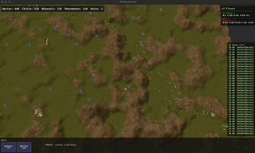

# Bio Dynasties



A real-time strategy game built with [Bevy](https://bevyengine.org/) (Rust).

## Features

- Procedurally generated terrain with triplanar texture mapping
- Unit production, movement, and pathfinding
- Combat system with health and lifecycle management
- Resource gathering and cargo transport
- Building construction with grid-based placement
- Formation movement
- AI opponents with goal-driven strategy
- Time controls (pause, speed up)
- Selection, hover effects, and tooltip UI

## Building & Running

```bash
# Debug (fast compile)
cargo run

# Release
cargo run --release
```

Requires Rust (stable) and the [Bevy dependencies](https://bevyengine.org/learn/quick-start/getting-started/setup/) for your OS.

## Architecture

The codebase is organized into Bevy plugins by concern:

| Module | Responsibility |
|---|---|
| `rts/` | Core RTS systems: movement, pathfinding, combat, construction, production, selection, resources |
| `ai/` | AI goal generation and strategy; communicates via events handled by `rts/` systems |
| `entities/` | Entity factory and lifecycle (spawn/despawn) |
| `world/` | Terrain generation, building grid, static mesh |
| `ui/` | HUD, action panels, tooltips, resource display |
| `rendering/` | Animations, hover effects, custom shaders |
| `core/` | Collision, time controls, shared game sets |
| `scene/` | Initial scene setup |
| `debug/` | Debug overlays and AI goal inspection |

### Event-Driven Design

Systems communicate exclusively through Bevy events. No system writes to components it does not own. AI goal executors and player input systems emit events; common `rts/` modules apply the resulting state changes.
